# Informe tecnico

**Proyecto:** Talent ScoutTech
**Autor:** Luis Carlos Romero Navarro
**Tipo de prueba:** Pentesting de aplicación web
**Metodología:** OWASP Web Security Testing Guide (WSTG)
**Fecha:** 15/01/2026

---

## 1. Introducción

El presente documento recoge el **informe técnico de pentesting**, dando respuesta directa y detallada a las preguntas planteadas en la práctica. El objetivo es identificar, explotar y explicar vulnerabilidades de seguridad presentes en la aplicación web **Talent ScoutTech**, utilizando únicamente la interacción con la aplicación web, salvo cuando el enunciado autoriza explícitamente la revisión de código fuente.

---

## 2. Alcance y metodología

### 2.1 Alcance

**Incluido:**

* Formularios de autenticación
* Gestión de jugadores y comentarios
* Control de acceso y sesiones
* Interacción cliente-servidor

**Excluido:**

* Infraestructura externa
* Servicios de terceros

### 2.2 Metodología

La auditoría se ha llevado a cabo siguiendo las fases definidas por OWASP:

1. Reconocimiento
2. Identificación de vulnerabilidades
3. Explotación manual
4. Análisis de impacto
5. Propuesta de mitigación

---

## Parte 1 – SQL Injection

### 3.a Error en la consulta SQL del formulario de autenticación

Al introducir como nombre de usuario el siguiente valor:

```
" OR "1"="1"
```

la aplicación devuelve un mensaje de error SQL similar a:

```
Warning: SQLite3::query(): Unable to prepare statement
Invalid query: SELECT userId, password FROM users WHERE username = "" OR "1"="1""
```
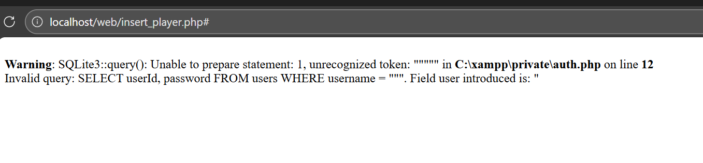

A partir de este error se deduce que la consulta SQL ejecutada es:

```
SELECT userId, password FROM users WHERE username = "<usuario>"
```

Conclusiones:

* La consulta **solo utiliza el campo username** del formulario.
* El campo password **no se utiliza en la consulta SQL**, sino que se compara posteriormente en PHP.
* La concatenación directa del input del usuario provoca la vulnerabilidad.

---

### 3.b Impersonación de usuario mediante SQL Injection

Utilizando el diccionario de contraseñas proporcionado y la vulnerabilidad detectada, se empleó el siguiente payload en el campo usuario:

```
" OR password="1234" --
```
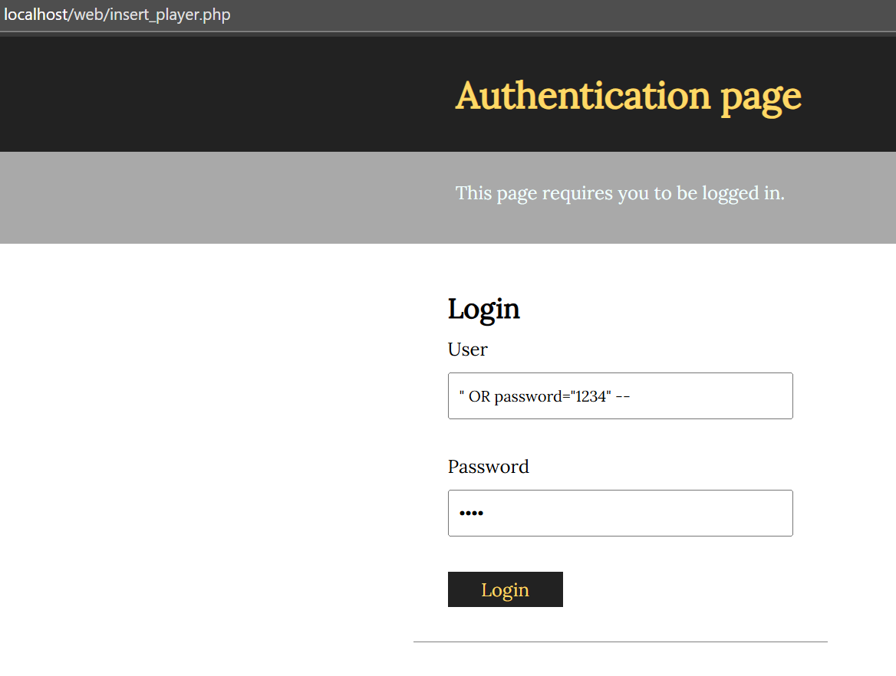

Este ataque permite autenticarse como el usuario **luis**, cuya contraseña es `1234`, sin conocer previamente los nombres de usuario registrados.

Impacto:

* Bypass completo de autenticación
* Acceso no autorizado a la aplicación

---

### 3.c Error de programación en areUserAndPasswordValid

Aunque se utiliza `SQLite3::escapeString()`, el error de programación consiste en:

* Escapar manualmente el input pero **concatenarlo igualmente en la consulta SQL**
* No utilizar **sentencias preparadas**
* Comparar la contraseña en PHP en lugar de hacerlo en SQL

Corrección recomendada:

* Uso de consultas preparadas (`prepare()` y `bindValue()`)
* Validar usuario y contraseña en la propia consulta SQL

Ejemplo de corrección:

```
SELECT userId FROM users WHERE username = :user AND password = :password
```

---

### 3.d Suplantación de usuarios mediante add_comment.php~

Mediante fuerza bruta de directorios se localizó el archivo:

```
add_comment.php~
```

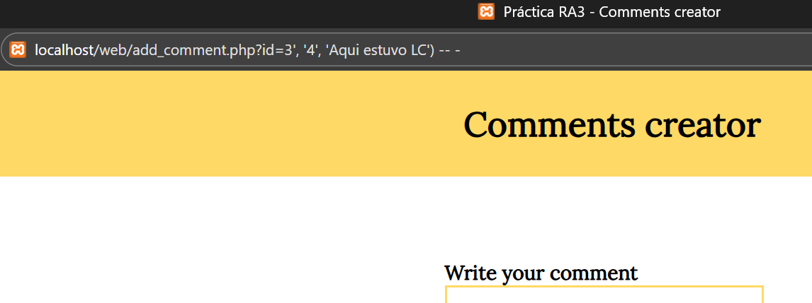
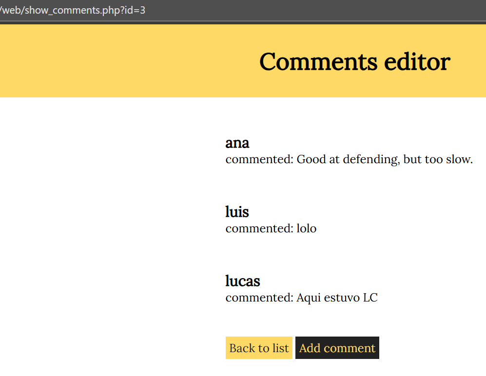

Este archivo expone el código fuente original y revela que el identificador de usuario (`userId`) se recibe directamente desde el cliente sin validación.

Vulnerabilidad:

* **Broken Access Control**
* Confianza en datos controlados por el cliente

Ataque:

* Modificar el parámetro `userId` en la petición POST
* Publicar comentarios en nombre de otros usuarios

---

## Parte 2 – Cross Site Scripting (XSS)

### 4.a XSS almacenado en comentarios

Se introdujo el siguiente comentario:

```
<script>alert('XSS')</script>
```

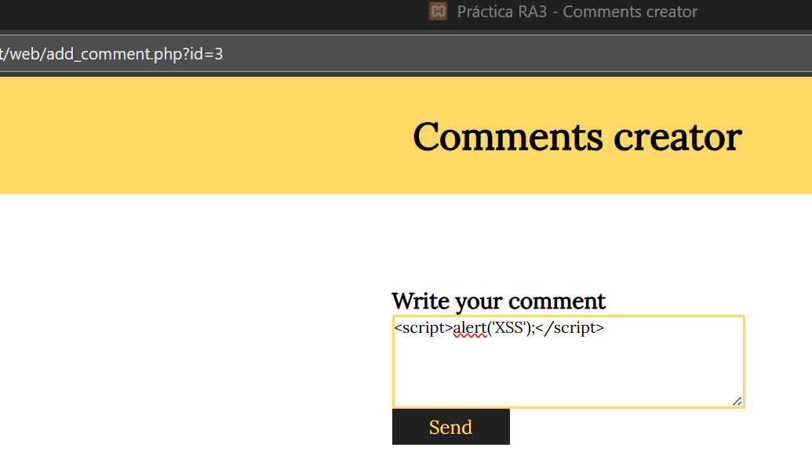
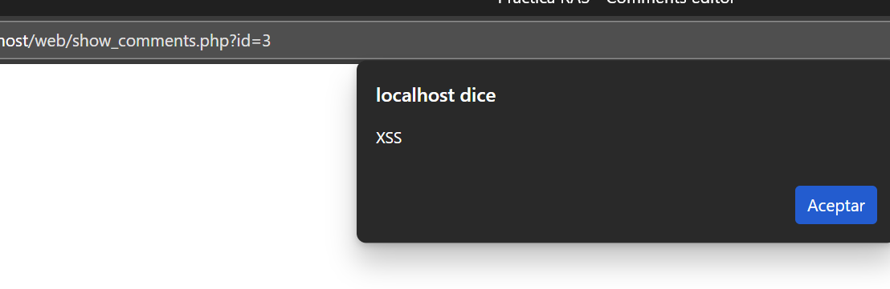

Al visualizar los comentarios, el código JavaScript se ejecuta automáticamente.

---

### 4.b Uso de & en enlaces HTML

El carácter `&amp;` es la representación HTML escapada del carácter `&`, necesaria para evitar ambigüedades en el código HTML. En el navegador, el enlace se interpreta correctamente como `&`.

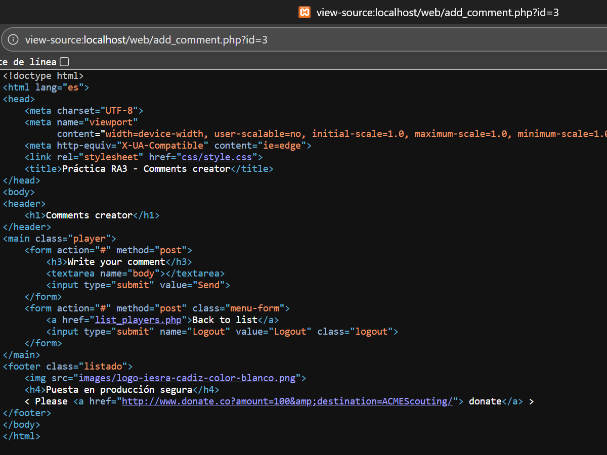

---

### 4.c Problema de show_comments.php

La página muestra directamente el contenido almacenado en la base de datos sin aplicar funciones de escape como `htmlspecialchars()`.

Corrección:

* Escapar toda salida HTML
* Implementar validación de entrada

---

### 4.d Otras páginas vulnerables a XSS

Se identificaron vulnerabilidades similares en otras páginas que muestran contenido dinámico sin saneamiento. Esto se detectó replicando el mismo payload XSS en distintos formularios y observando su ejecución.
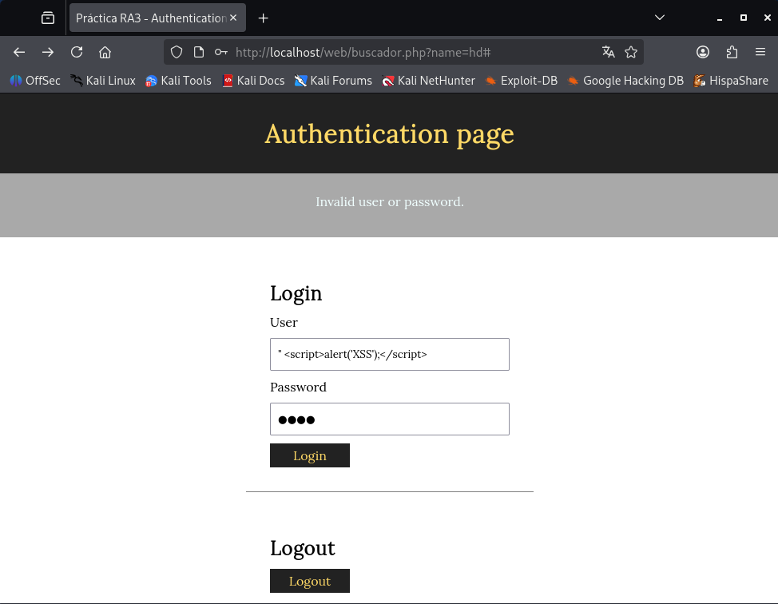
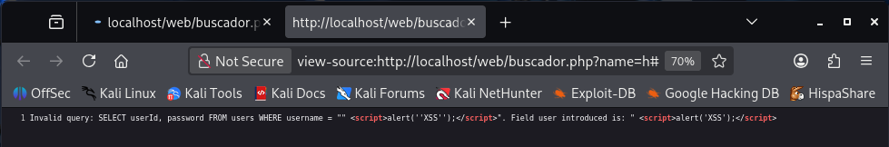

---

## Parte 3 - Autenticación, control de acceso y sesiones

### a) Seguridad en el registro de usuarios (register.php)

Problemas detectados en el registro
Durante el análisis se han encontrado los siguientes problemas:

- El usuario y la contraseña se usan directamente en la consulta SQL, lo que permite ataques de SQL Injection.
- No se comprueba si los campos están vacíos.
- Los errores no se gestionan de forma segura.
- Las contraseñas se guardan en texto plano.
- El formulario de registro no tiene protección frente a CSRF.

Medidas aplicadas
De todas estas vulnerabilidades, se han aplicado las medidas que son más fáciles de implementar sin cambiar el funcionamiento general de la aplicación:

- Se valida que el usuario y la contraseña no estén vacíos.
- Se utilizan consultas preparadas para evitar SQL Injection.
- Se controla el error de la consulta sin mostrar información sensible.

### b) Seguridad en el login de usuarios (auth.php)

Problemas detectados en el login
Durante el análisis se han encontrado los siguientes problemas:

- La consulta SQL usaba directamente los valores introducidos por el usuario, lo que permitía ataques de SQL Injection.
- Los mensajes de error no se mostraban escapados, pudiendo provocar XSS si se incluían datos maliciosos.
- Las contraseñas se comparaban en texto plano.
- Las cookies usadas para la sesión (user y password) no estaban marcadas como HttpOnly ni Secure.
- No hay protección frente a CSRF en los formularios de login y logout.

Medidas aplicadas
De todas estas vulnerabilidades, se han aplicado las medidas que son factibles sin cambiar la arquitectura general de la aplicación:

- Se utilizan consultas preparadas para evitar SQL Injection.
- Se comprueba que la fila devuelta exista antes de comparar la contraseña.
- Los mensajes de error se muestran usando htmlspecialchars($error) para evitar XSS.

### c) Gestión del acceso a la página de registro (register.php)

Problema detectado
- La página de registro está abierta a todos los usuarios.
- Esto puede permitir registros no autorizados y aumentar riesgos de seguridad.

Medida aplicada
Para limitar el acceso sin cambiar toda la aplicación:

- Se comprueba si el usuario ya está autenticado mediante cookies.
- Si el usuario ya tiene sesión activa, se le redirige automáticamente a la página de lista de jugadores (list_players.php), evitando que pueda acceder al registro.

### d) Protección de la carpeta private

Al inicio de la práctica se asume que la carpeta private no es accesible desde el navegador. Sin embargo, al montar la aplicación en local, esta condición no siempre se cumple, ya que el servidor web puede permitir el acceso directo a esa carpeta si no se configura correctamente.

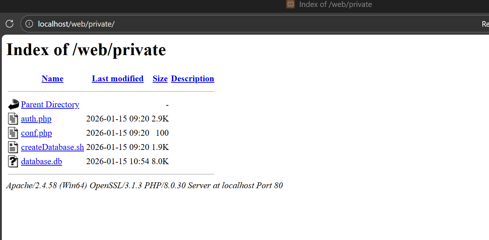

Problemas detectados
Durante el análisis se detectan los siguientes riesgos:

- La carpeta private puede ser accesible directamente desde el navegador.
- Archivos como conf.php o auth.php contienen información sensible.
- Un atacante podría visualizar o descargar estos archivos.
- La seguridad depende solo de "suponer" que no se accede a esa carpeta.

Medidas de seguridad posibles
Para evitar este problema, se pueden aplicar varias medidas:

- Mover la carpeta private fuera del directorio público (htdocs, www, etc.).
- Configurar el servidor web para bloquear el acceso a esa carpeta.
- Usar archivos .htaccess para denegar el acceso directo.
- Evitar mostrar errores del servidor que revelen rutas internas.

### e) Seguridad de la sesión de usuario

Problemas detectados
Durante el análisis se detectan los siguientes problemas:

- Las cookies almacenan la contraseña en texto plano, lo que permitiría suplantar a un usuario si se capturan.
- No se utilizan sesiones de PHP ($_SESSION), por lo que no existe un control real de la sesión.
- La sesión depende únicamente de cookies manipulables por el cliente.
- No se regeneran identificadores de sesión tras el login.
- No existe control de caducidad ni invalidación automática de sesión.

Medidas de seguridad posibles
En una aplicación más segura, deberían implementarse las siguientes medidas:

- Usar sesiones de PHP (session_start()) y almacenar solo el userId en la sesión.
- Eliminar completamente el uso de la contraseña en cookies.
- Regenerar el ID de sesión tras el login para evitar fijación de sesión.
- Destruir la sesión correctamente al hacer logout.
- Usar cookies con atributos HttpOnly y Secure.
- Forzar el uso de HTTPS.

## Parte 4 - Servidores web

Cuando analizamos la seguridad de una aplicación, no podemos olvidarnos del servidor web donde está alojada. Aunque la aplicación esté bien hecha, si el servidor está mal configurado, los atacantes lo tienen mucho más fácil. Por eso es importante aplicar una serie de medidas básicas para reducir riesgos.

#### Actualización del sistema
Lo primero es mantener el sistema operativo y todos los servicios al día.
Actualizar los paquetes, usar versiones recientes de Apache y PHP y evitar versiones sin soporte ayuda a que no se puedan explotar vulnerabilidades conocidas.

#### Configuración segura de Apache
La configuración por defecto de Apache suele mostrar demasiada información.
Algunas cosas que conviene hacer son:

Desactivar el listado de directorios

Ocultar la versión del servidor y del sistema

Bloquear el acceso a carpetas sensibles como private

Controlar el uso de archivos .htaccess

#### Uso de HTTPS
HTTPS es esencial hoy en día.
Sirve para:

Evitar que las credenciales viajen en texto plano

Proteger las cookies de sesión

Reducir ataques Man-in-the-Middle

En un entorno real siempre se debe usar un certificado válido.

#### Permisos de archivos y carpetas
Los permisos mal puestos pueden abrir la puerta a accesos no autorizados.
Por eso es importante:

No usar permisos 777

Dar al servidor web solo los permisos necesarios

Separar archivos públicos de los privados

#### Configuración de PHP
PHP también necesita una configuración segura. Algunas buenas prácticas son:

Desactivar display_errors en producción

Activar log_errors

Limitar la subida de archivos

Desactivar funciones peligrosas si no se usan

#### Protección básica contra ataques
Para evitar ataques automáticos o abusos:

Limitar los intentos de login

Usar un firewall básico

Revisar los logs del servidor

Utilizar herramientas como fail2ban

## Parte 5 – Cross Site Request Forgery (CSRF)

En este apartado se aprovecha que la aplicación permite introducir *HTML en los campos del formulario de edición de jugadores y que estos datos se muestran posteriormente en list_players.php sin ningún tipo de filtrado.

El objetivo es conseguir que aparezca un botón llamado Profile que redirija al usuario al enlace proporcionado en el enunciado:

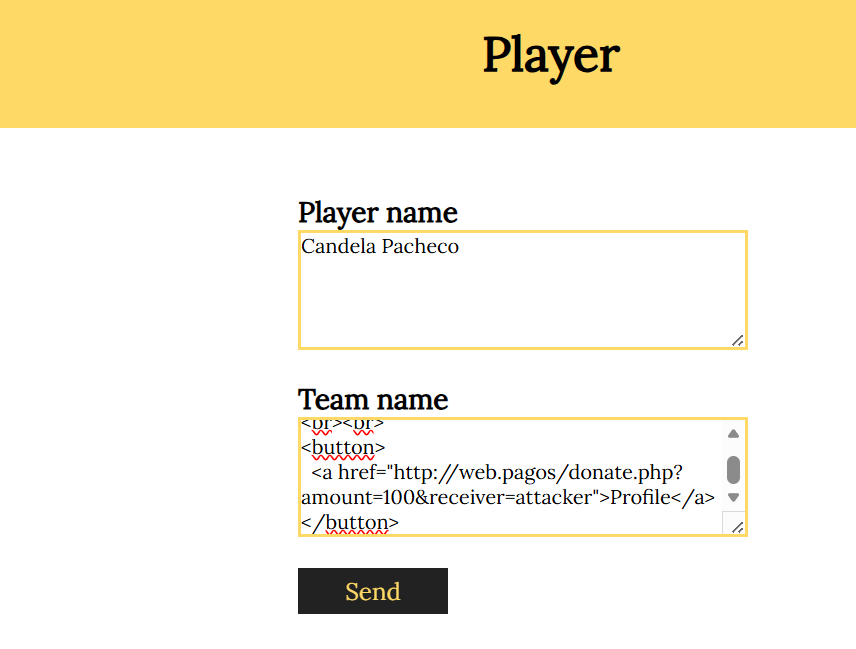

Con esto se consigue que, al mostrarse el listado de jugadores, el nombre del equipo se muestre normalmente y justo debajo aparezca el botón Profile, mejorando la visibilidad del ataque y haciéndolo más creíble para el usuario.

Cuando cualquier usuario visualiza el listado de jugadores, el navegador interpreta el código HTML inyectado. Al hacer clic en el botón Profile, el usuario es redirigido a la URL:
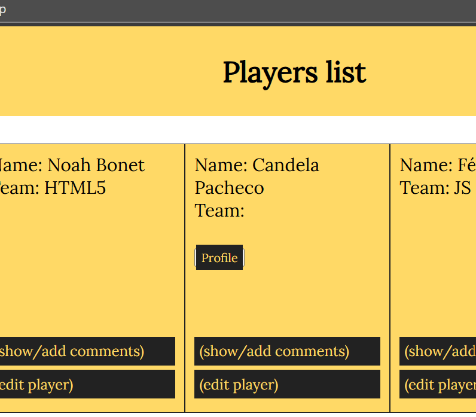

### b) Ataque CSRF sin interacción del usuario
Después de comprobar que el ataque del apartado anterior funciona, es evidente que sería mucho más efectivo si el usuario no tuviera que hacer clic en ningún botón.

Para esto, se aprovecha que la página show_comments.php es vulnerable a XSS, ya que los comentarios se muestran directamente en la web sin ningún tipo de filtrado o escape del contenido.

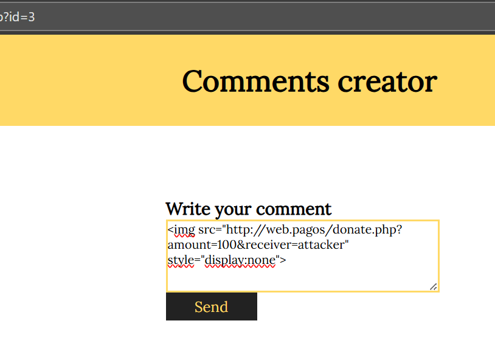
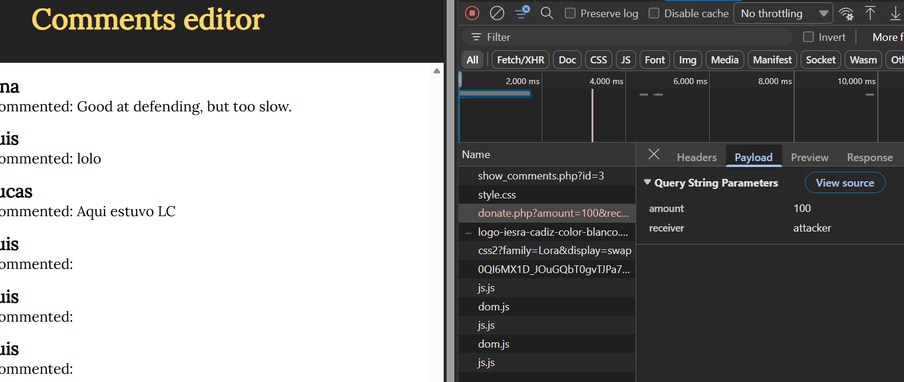

Si el usuario está logueado en la plataforma web.pagos, se ejecuta la donación de 100€ al usuario attacker.

### c) Condición necesaria para que se ejecute la donación
El usuario que visualiza el comentario malicioso o pulsa el botón tiene que estar autenticado en la plataforma web.pagos en ese momento.

Esto es así porque web.pagos solo permite realizar donaciones entre usuarios registrados. Si el usuario tiene una sesión activa, su navegador enviará automáticamente la cookie de sesión al cargar la URL donate.php, y el servidor asumirá que la petición es legítima.

De esta forma, los 100€ se descuentan de la cuenta del usuario víctima y se transfieren al usuario attacker sin que el usuario tenga que confirmar nada.

### d) Ataque CSRF enviando parámetros por POST
Cambiar el método de envío de parámetros de GET a POST no soluciona el problema CSRF. Aunque a simple vista pueda parecer más seguro, el navegador sigue enviando automáticamente las cookies de sesión cuando se hace una petición POST, igual que con GET.

Para realizar un ataque equivalente al del apartado b), se puede insertar un comentario que contenga un formulario oculto que se envíe automáticamente al cargarse la página.

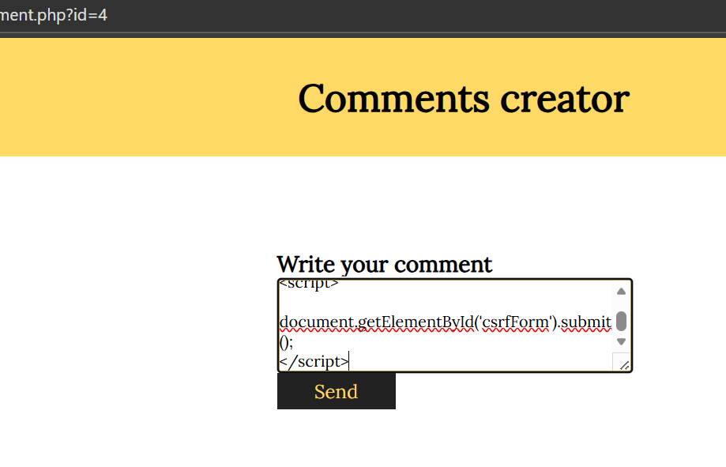
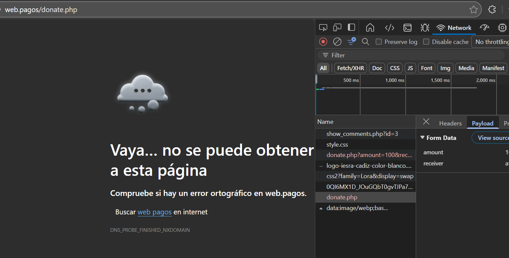